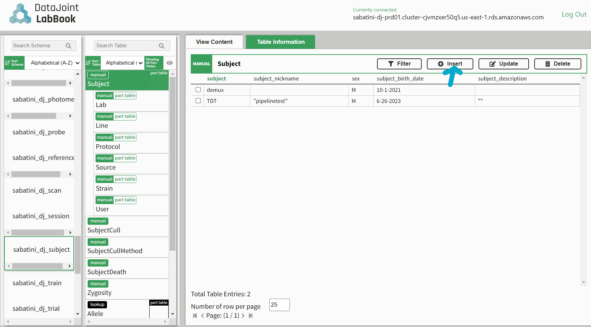
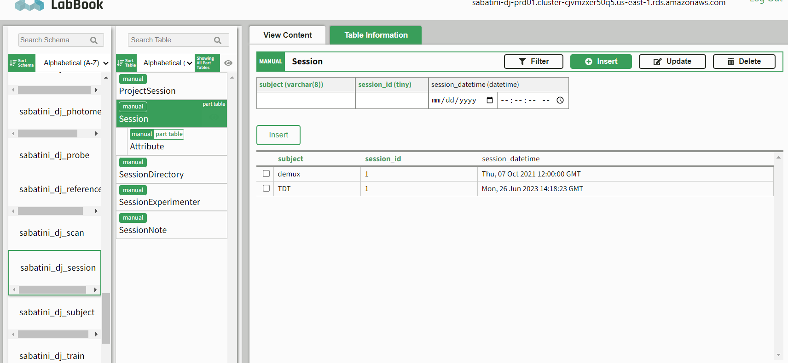
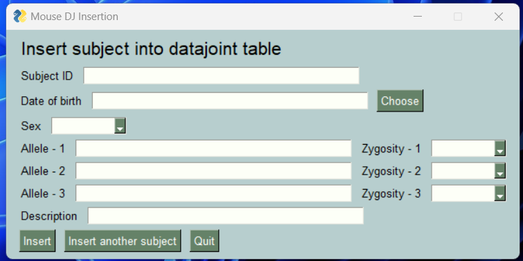
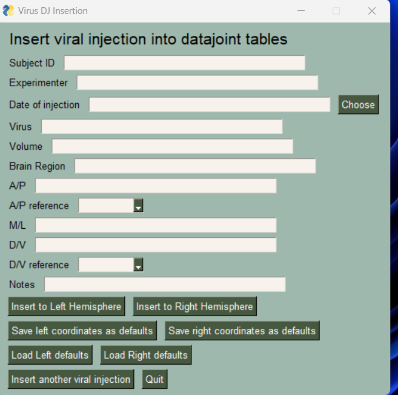
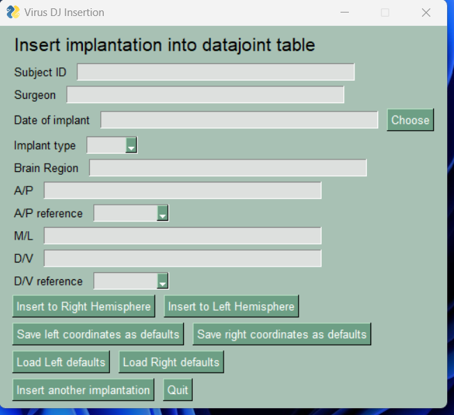
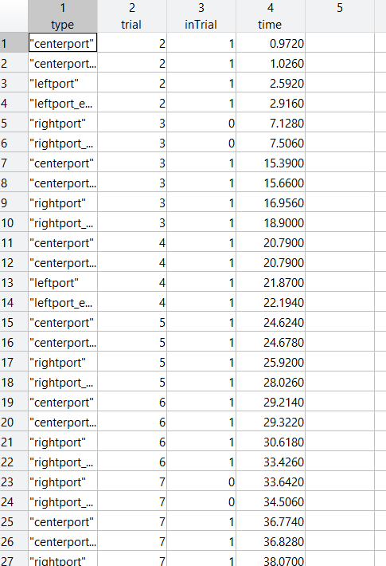
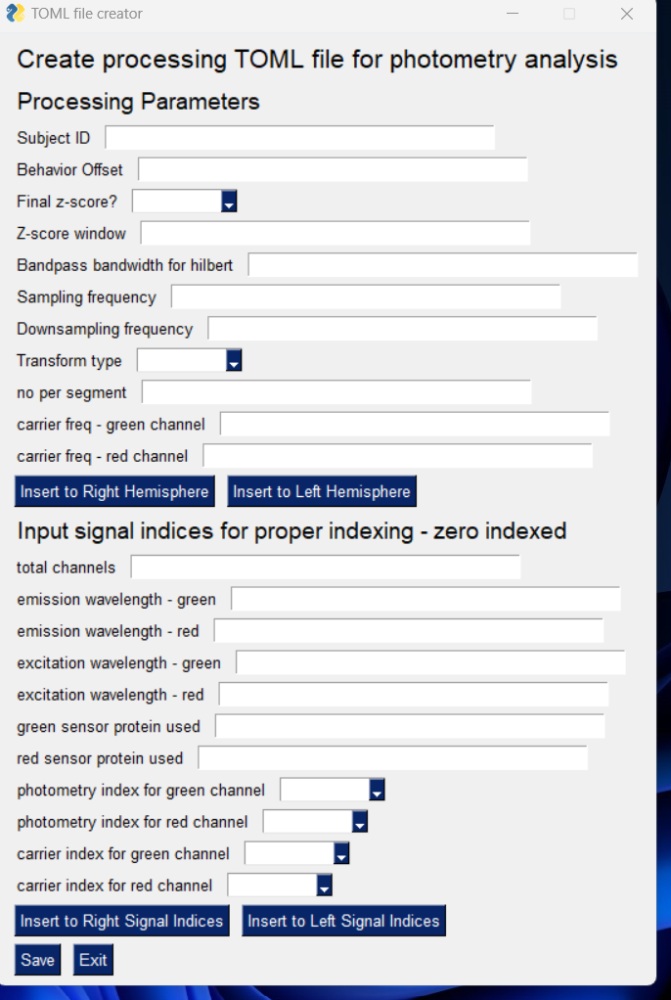
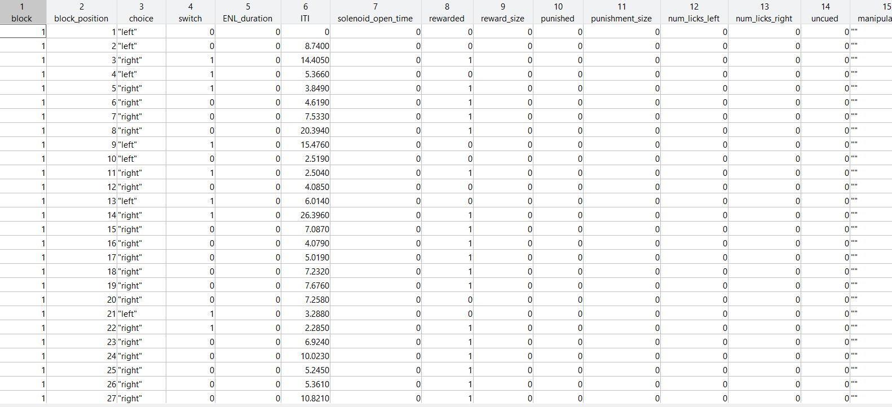
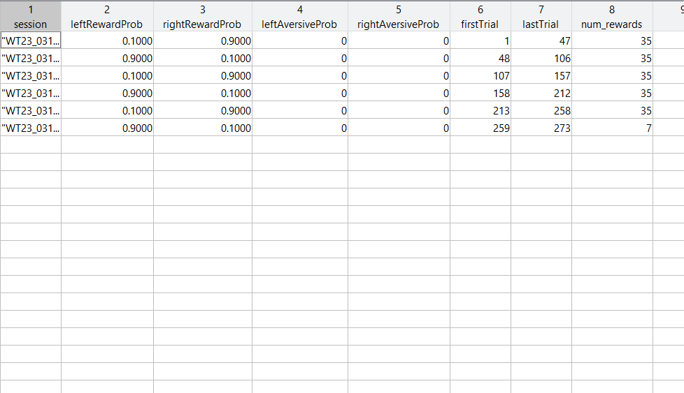

How To
======

The sabatini-datajoint-pipeline uses `DataJoint for Python <https://datajoint.com/docs/core/datajoint-python/0.14/>`_. 

The workflow is based on relational principles and makes it simple to keep track of the data provenance and to query the data.
If you are new to DataJoint, we recommend getting started by learning about the principles and foundations that make up DataJoint.
More information can be found in the `DataJoint documentation <https://datajoint.com/docs/core/datajoint-python/0.14/concepts/principles/>`_.

We can run the workflow using the provided docker containers (for more information :doc:`WorkerDeployment`). Or, we can 
run locally using the `provided jupyter notebooks <https://github.com/bernardosabatinilab/sabatini-datajoint-pipeline/tree/d3f95ccd94521bfeac64929ad44a8cc7a46a61db/notebooks>`_.
These notebooks provide a good starting point and can be modified to fit your needs, just remember to check that your kernel is set
to the ``sabatini-datajoint`` kernel.  

Setting up your data directories
#################################

Your data ``/Inbox`` directory structure will need to be set up like the following: 

|
| Subject1
| ├── Session1

|    ├── Imaging
|     ├── scan0
|        ├── 00001.tif
|        ├── 00002.tif
|        └── ...

|    ├── Photometry
|       ├── timeseries*.mat; data.mat; .tdt
|       └── .toml

|    ├── Behavior
|       ├── .toml
|       └── .parquet, .csv

|    ├── Ephys
|       └── .bin, .lf, .meta

|    ├── dlc_projects
|       └── PROJECT_PATH
|    ├── dlc_behavior_videos
|       └── .avi

|
| ├── Session2
|   └── ...

Note that the ``Subject`` is the top level directory, and all other data types are nested. You do not need to have all data types for each session.

Inserting into the Subject and Session tables
#############################################

To initate the workflow, we will first need to populate the ``Subject``, ``Session``, and ``SessionDirectory`` tables. There are two ways to do this:

* We can use a jupyter notebook/CLI/iPython terminal
  
* We can use the `DataJoint LabBook GUI <https://labbook.datajoint.io/login>`_.

**Let's start with the jupyter notebook/CLI/iPython terminal.** 

.. literalinclude:: ../helpers/insertion.txt

Importantly, your ``Subject``, ``Session``, and ``SessionDirectory`` structure will need to match the directory structure in your ``/Inbox`` directory.

**We can also do this through the DataJoint LabBook GUI.**

1. Go to the `DataJoint LabBook GUI <https://labbook.datajoint.io/login>`_ and login with your credentials.
   
2. Now, you will be able to view all the schemas available to you on the left hand side. 
   
3. Navigate to the ``sabatini_dj_subject`` scehma and click on the ``Subject`` table.
   
4. Click ``Insert`` and fill out the form.
   

5. Then, navigate to the ``sabatini_dj_session`` schema and click on the ``Session`` table.
   
6. Click ``Insert`` and fill out the form.
   

7. Lastly, within the ``sabatini_dj_session`` schema, click on the ``SessionDirectory`` table and fill out the form. 
   
.. image:: ../media/session_dir.png
    :align: center
    :width: 100%
    :alt: session_dir

After successful insertion of the ``Subject``, ``Session``, and ``SessionDirectory`` tables, we can then proceed with operating the rest of the pipeline.

Inserting into the Reference tables
###################################
The ``Reference`` tables are used to store information about the mouse (e.g. allele, zygosity) and surgical information (e.g. implants, viral injections).
Importantly, each table uses the ``Subject_ID`` as the primary key. Therefore, remember your Subject_ID's!

There are two ways to do this:

1. Through the `DataJoint LabBook GUI <https://labbook.datajoint.io/login>`_
2. Our python provided GUIs that are run locally. 

Here, we will cover how to insert the data through our python provided GUIs. The GUIs will automatically login to the database using the credentials
you provided in the ``dj_local_conf.json`` file.

The mouse reference table
--------------------------

Within the sabatini-datajoint environment, start the GUI from the upper level sabatini-datajoint-pipeline directory:

.. code-block:: bash

    python .\TOML-metafile-scripts\Insert_mouse.py
    

A GUI will pop up that looks like this:

Fill out the form and click ``Insert``. If successful, you will see a message that says ``Inserted subject information for: YOUR_SUBJECT_NAME`` 
in the command window.

If you need to insert more than one mouse, click ``Insert another subject`` and repeat the process. Once finished, you can close the GUI
by selecting ``Quit``.

The virus reference table
--------------------------

Within the sabatini-datajoint environment, start the GUI from the upper level sabatini-datajoint-pipeline directory:

.. code-block:: bash

    python .\TOML-metafile-scripts\Insert_virus.py

A GUI will pop up that looks like this:

The ``Virus`` table is a reference table that stores information about the virus used for the experiment and treats each hemisphere 
as a separate entry. For example, if you injected a virus into the left hemisphere and the right hemisphere, you will fill out the appropriate
information then select ``Insert to Right Hemisphere`` and ``Insert to Left Hemisphere``.

If successful, you will see ``Inserted to Right Hemisphere`` or ``Inserted to Left Hemisphere`` in the command window.

If you need to insert more than one surgery, click ``Insert another viral injection`` and repeat the process. Once finished, you can close the GUI
by selecting ``Quit``.

The implant reference table
----------------------------

Within the sabatini-datajoint environment, start the GUI from the upper level sabatini-datajoint-pipeline directory:

.. code-block:: bash

    python .\TOML-metafile-scripts\Insert_implantation.py

A GUI will pop up that looks like this:

The ``Implant`` table is a reference table that stores information about the implant used for the experiment and treats each hemisphere
as a separate entry. For example, if you implanted a fiber into the left hemisphere and the right hemisphere, you will fill out the appropriate
information then select ``Insert to Right Hemisphere`` and ``Insert to Left Hemisphere``.

If successful, you will see ``Right Implantation inserted into Implantation table`` or ``Left implantation inserted into Implantation table`` in the command window.

If you need to insert more than one surgery, click ``Insert another implant`` and repeat the process. Once finished, you can close the GUI
by selecting ``Quit``.

Photometry and PhotometrySync pipeline
######################################
The photometry pipeline is designed to process photometry data from the Sabatini lab from various data acquisition streams (e.g. labjack or TDT).
The pipeline is designed to be modular, so that you can run the pipeline on any combination of data types. 
For example, you can run the pipeline on only the photometry data, or you can run the pipeline on the photometry data and the behavior data to sync
the photometry signal.

Input data
----------
You will need a photometry timeseries collected from a labjack (e.g. matlab) or TDT system. You will also need to fill out meta information within 
the ``.toml`` file. More on how to do this in the *Creating a .toml file for photometry processing* section. 

**Matlab/Labjack data naming conventions**:

There are two processing streams for the matlab input data. The first is raw/unprocessed data, and the second is processed (demodulated) data.

To enter the raw/unprocessed data into the pipeline, the data must be named in the following format: ``*timeseries_2.mat``.
To enter the processed data into the pipeline, the data must be named in the following format: ``data*.mat``.

The ``.toml`` file must be named in the following format: ``*.toml``.

Importantly, the ``transform`` field in the ``.toml`` file must be set to ``transform = spectrogram`` for the matlab data.

**TDT data naming conventions**:

To enter the TDT data into the pipeline, the data must have all of the associated TDT files ``*.t*`` and must also have a ``.toml`` file associated with it.

The TDT processing stream can handle two different transform types: ``transform = spectrogram`` or ``transform = hilbert``.

``transform = hilbert``: uses Celia Beron's processing pipeline.

``transform = spectrogram``: uses a python version of Bernardo Sabatini's processing pipeline.

**Behavior data naming conventions**:

The behavior data must be named in the following format: ``*.parquet`` (for ``transform = spectrogram``) or ``*.csv`` (for ``transform = hilbert``).

You will also need a meta data file associated with the behavior data. The meta data file must be named in the following format: ``*.toml``. Here,
you can also pass an extra paramater called ``final_z = true/false`` if you would like to do a final z_score of the photometry data. Importantly, you
must set the ``behavior_offset`` field in the ``.toml`` file to indicate the time offset between the photometry data and the behavior data.

The behavior data must have an event table with a ``time`` field and ``event`` field. 

Running the photometry pipeline
-------------------------------
Once you have inserted the ``Subject``, ``Session``, and ``SessionDirectory`` tables and you have the appropriate files in place, you can then proceed with running the photometry pipeline by
simply upping the standard_worker docker container detailed in :doc:`WorkerDeployment`. It will automatically detect the new data and process it and populate the ``Photometry`` table.

You can also run the pipeline manually by running the following: 

.. literalinclude:: ../helpers/photometry_pipeline.txt

If you are using the docker container, the pipeline will automatically search and process the behavior data as well. If you are manually running the pipeline,
you will need to populate the ``SyncedPhotometry`` table by running the following:

.. literalinclude:: ../helpers/synced_photometry.txt

Class heirarchy and inheritance
-------------------------------

.. literalinclude:: ../helpers/photometry_table.txt

Creating a .toml file for photometry processing
###############################################
To help create a ``.toml`` file, we have provided a python GUI that will guide you through the proper creation of the file. You can find the GUI in the ``TOML-metafile-scripts`` directory.

To start, open a python terminal and activate your sabatini-datajoint envrionment:

.. code-block:: python

    python ./TOML-metafile-scripts/makeTOML.py

A GUI will pop up and you will be able to fill out the relevant information. This will create the proper formatting
for the ``.toml`` file and is advantageous if you need to edit it in the future. 

Importantly, you will need to "insert" the proper information into the "right" and "left" hemisphere fields. The TOML will 
be created with the proper formatting for the pipeline to process the data and handles the two hemispheres seperately. 

Once you have filled out the GUI, hit the ``Save`` button. You will then be prompted to save the ``.toml`` file in
the directory containing your photometry data.

Behavior pipeline
#################
The behavior pipeline is designed to process behavior data that has been preprocessed into a ``.parquet`` or ``.csv`` file.
It is built using the `Elements Event <https://datajoint.com/docs/elements/element-event/0.2/concepts/>`_ and therefore, requires some 
formatting of the data.

Input data
----------
You will need an ``eventTable`` with a ``time``, ``event``, and ``trial`` field.

A ``trialTable`` that has a minimum of ``block``, ``session_position``.

A ``blockTable`` describing block attributes and a minimum of ``firstTrial`` or ``start_trial`` and ``lastTrial`` or ``end_trial`` .

Have events that may not be considered within a trial? Not to worry, you can add a column in ``eventTable`` called
``inTrial`` and set it to ``0`` or ``1``.

Running the behavior pipeline
-----------------------------
Once you have inserted the ``Subject``, ``Session``, and ``SessionDirectory`` tables and you have the appropriate files in place, you can then proceed with running the behavior pipeline by
simply upping the standard_worker docker container detailed in :doc:`WorkerDeployment`. It will automatically detect the new data and process it and populate the ``Event`` table.

You can also run the pipeline manually by running the following:

.. literalinclude:: ../helpers/behavior_pipeline.txt

Ephys pipeline
##############
The ephys pipeline is designed to process neuropixel data acquired with SpikeGLX. It will run through Kilosort2.5 and use
`ecephys <https://github.com/jenniferColonell/ecephys_spike_sorting>`_ for post-processing.
The ``/Outbox`` directory will be automatically populated with the processed data.

Input data
----------
You will need all of the output files from SpikeGLX: ``.ap.bin``, ``.lf.bin``, ``.ap.meta``, and ``.lf.meta``. You can also use data that you have pre-processed throught CatGT.

Running the ephys pipeline
--------------------------
Once you have inserted the ``Subject``, ``Session``, and ``SessionDirectory`` tables and you have the appropriate files in place,
you can then proceed with running the ephys pipeline by simply upping the spike_sorting_local_worker docker container detailed in :doc:`WorkerDeployment`.

Using the docker container is the recommended way to run the pipeline. If you must run the pipeline manually, please contact the database manager.

Table organization
------------------
The following tables will be populated after running the ephys pipeline:

``ephys.EphysRecording()``, ``ephys.CuratedClustering()``, ``ephys.WaveformSet()``, ``ephys.LFP()``

Calcium imaging pipeline
########################
The calcium imaging pipeline is designed to process calcium imaging data through Suite2P. It will automatically populate the ``/Outbox`` directory with the processed data.

Input data
----------
You will need all of the ``.tif`` files output from ScanImage.

Running the calcium imaging pipeline
------------------------------------
Once you have inserted the ``Subject``, ``Session``, and ``SessionDirectory`` tables and you have the appropriate files in place, you will need to first
up the standard_worker docker container detailed in :doc:`WorkerDeployment`. Then, you will need to up the calcium_imaging_worker docker container.

A simple way to run the pipeline is to run the provided
`Calcium Imaging Jupyter Notebook <https://github.com/bernardosabatinilab/sabatini-datajoint-pipeline/blob/5d38f22f2caabf8cc91cb6fd18be2dbfaa632a2c/notebooks/calcium_imaging.ipynb>`_.

Table organization
------------------
The calcium imaging processing pipeline will populate the ``imaging`` table. 

DeepLabCut pipeline
###################
The DeepLabCut pipeline is designed to process videos through DeepLabCut. It will automatically populate the ``/Outbox`` directory with the processed data.

**Important Note**: This pipeline assumes that you have already created a DeepLabCut project and have a trained network. If you have not done this, please
refer to the `DeepLabCut documentation <https://deeplabcut.github.io/DeepLabCut/README.html>`_. 

Input data
----------
You will need a pretrained network organized in the following format: ``/Inbox/dlc_projects/PROJECT_PATH``. You will also need to have the videos you would like to process
organized in the following format: ``/Inbox/Subject/dlc_behavior_videos/*.avi``.

Running the DeepLabCut pipeline
-------------------------------
This is a manual pipeline. You will need to run the provided `DeepLabCut jupyter notebook <https://github.com/bernardosabatinilab/sabatini-datajoint-pipeline/blob/5d38f22f2caabf8cc91cb6fd18be2dbfaa632a2c/notebooks/dlc.ipynb>`_.
You will need to edit all of the relevant information and paths in the notebook.

Table organization
------------------
The DeepLabCut processing pipeline will populate the ``model`` table.

General pipeline architecture
#############################
For any questions regarding the pipeline architecture, the whole pipeline can be visualized in our `GitHub page <https://github.com/bernardosabatinilab/sabatini-datajoint-pipeline/blob/5d38f22f2caabf8cc91cb6fd18be2dbfaa632a2c/notebooks/pipeline-architecture.ipynb>`_.

For pipelines that were designed using DataJoint Elements (e.g. Event, Ephys, Calcium Imaging, DLC), more information can be found in the `DataJoint Elements documentation <https://datajoint.com/docs/elements/>`_.

