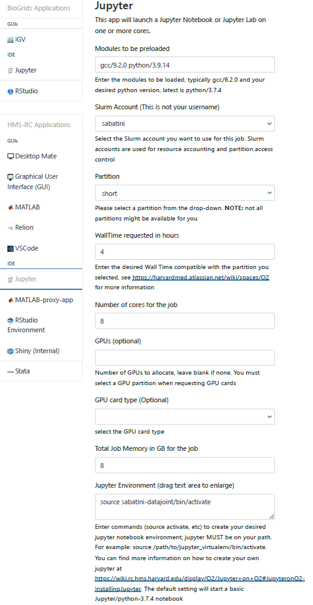

Installation
============

The sabatini-datajoint pipeline can be run locally or through Docker containers and requires access to our AWS server. To get started, you will need to install Docker and get access to our AWS server
by reaching out to HMS IT. 

Requirements
############

* Docker. Please follow the instructions for your operating system `here <https://docs.docker.com/get-docker/>`_.
  
* Anacoda or Miniconda. Please follow the `instructions for your operating system <https://docs.conda.io/projects/conda/en/latest/user-guide/install/>`_.
  
* If using Windows, we will also need a local installation of python. Please follow `these instructions <https://www.python.org/downloads/windows/>`_.
  
* If using Windows, you will need to `install the Windows Subsystem for Linux (WSL) and Ubuntu 20.04 <https://docs.microsoft.com/en-us/windows/wsl/install-win10>`_.
  
* For the DeepLabCut and Spike Sorting Workers, we will need a `CUDA compatible NVIDIA GPU <https://developer.nvidia.com/cuda-gpus>`_ and `drivers <https://developer.nvidia.com/cuda-toolkit-archive>`_ and `Microsoft C++ Build Tools <https://visualstudio.microsoft.com/visual-cpp-build-tools/>`_ for Windows.

Installation
############

1. After you have successfully installed Docker, Anaconda, and WSL, we will set up our conda environment.
   
.. literalinclude:: ../helpers/create_env.txt

You will need to activate the environment with ``conda activate sabatini-datajoint`` and navigate into the ``sabatini-datajoint`` directory.

**Optional**: If you are planning to make changes to the code, you may want to install the package in editable mode. This will allow you to make changes to the code and have them reflected in the Docker containers.
You can do this by running ``pip install -e .`` 

2. Create a copy of `.example_dj_local_conf.yaml <https://github.com/bernardosabatinilab/sabatini-datajoint-pipeline/blob/5d38f22f2caabf8cc91cb6fd18be2dbfaa632a2c/.example_dj_local_config.json>`_ 
and rename it to `dj_local_conf.yaml`. 

3. Fill in the appropriate information for the ``database.host``, ``database.user``, and ``database.password`` fields.

4. You may then launch ``jupyter notebook`` and navigate to the ``notebooks`` directory to run the notebooks. Please make sure to set your kernel to ``sabatini-datajoint``.
   

WSL Configuration for NVIDIA GPU Support
########################################

1. Using Windows Powershell, install Ubuntu in WSL by running

.. code-block:: bash

    wsl --install -d Ubuntu-20.04

2. Set Ubuntu to use WSL2
   
.. code-block:: bash

    wsl --set-version Ubuntu-20.04 2

3. Confirm that your local Ubuntu version is integrated in the docker app (Settings > Resources > WSL Integration)

4. Install `CUDA in WSL <https://docs.nvidia.com/cuda/wsl-user-guide/index.html#getting-started-with-cuda-on-wsl>`_.

5. Configure your WSL-Ubuntu as a root user in order to use the Docker containers. Run the following in Windows Powershell:
   
.. code-block:: bash

    ubuntu2004 config --default-user root

6. Install the NVIDIA Container Toolkit in WSL using the following specifications: Linux OS, x86_64 architecture, Ubuntu distribution, 20.04 release, version 2.0, runfile (local).
Then, follow the `base installer instructions <https://developer.nvidia.com/cuda-downloads?target_os=Linux&target_arch=x86_64&Distribution=WSL-Ubuntu&target_version=2.0&target_type=runfile_local>`_.

7. Confirm that /etc/docker/daemon.json contains a runtime component pointing to the correct nvidia-container-runtime path.
This is updated by default in Ubuntu, but may need to be manually set in Windows.

8. Restart Docker Desktop and WSL-Ubuntu.

9. Update all .env paths using the WSL-Ubuntu path. For example, ``/mnt/c/Users/username/..``.

O2 Configuration and Installation
##################################

1. Login to O2 and start an interactive session with the following command:
   
.. code-block:: bash

    srun --pty -p interactive -t 0-2:00 /bin/bash

2. Load the following modules:
   
.. code-block:: bash

    module load gcc/9.2.0
    module load python/3.9.14
            
3. Create your venv. *Note!* This must be in your home directory.
   
.. code-block:: bash

    virtualenv sabatini-datajoint

4. Then activate your venv.
   
.. code-block:: bash

    source sabatini-datajoint/bin/activate

5. Begin by installing jupyter and jupyterlab
   
.. code-block:: bash

    pip3 install jupyter jupyterlab

6. We can then clone our repo and install the requirements.
   
.. code-block:: bash

    git clone https://github.com/bernardosabatinilab/sabatini-datajoint-pipeline
    cd sabatini-datajoint-pipeline
    pip install -r requirements.txt
       
7. Following successful install, you can edit your local_config.json with your credentials
   and inbox/outbox directory. Remember you have access to all the filesystems available operating on O2.

8. We can now access the database via jupyter notebook on the `O2 portal <https://o2portal.rc.hms.harvard.edu/pun/sys/dashboard>`_.
9. Once you have logged into the O2 portal, you can open the Jupyter IDE by using the following specifications. However, keep
    in mind when you may need a GPU for certain notebooks such as DLC and Kilosort and change your partition accordingly.
    

  
